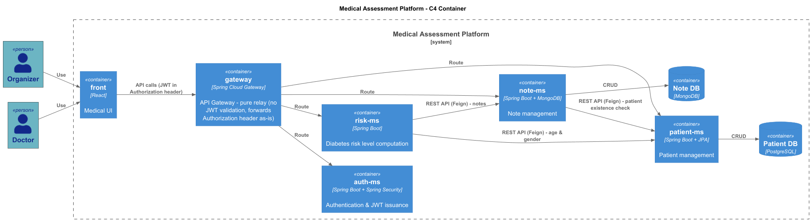

# MEDICAL ASSESSMENT

Microservices-based medical application allowing organizers ('ORGANIZER') to manage patient records 
and doctors ('DOCTOR') to view patients, write medical notes, and automatically get a diabetes risk assessment based on the analysis of those notes.

## Features
    - **Patient Management**: Create, view and update patient records (first name, last name, date of birth, gender, phone number, address).
    - **Medical Notes**: Doctor write consultation notes attached to a patient.
    - **Diabetes Risk Assessment**: Automatic analysis of patient's notes to detect medical triggers (weight, smoking, cholesterol, antibodies, etc.) and computation of a risk level ('None', 'BORDERLINE', 'IN DANGER', 'EARLY ONSET') based on age, gender and the number of triggers detected.
    - **Authentification**: JWT-based login, two roles (ORGANIZER, DOCTOR) with distinct permissions on each service.

## Architecture

The application is built using a microservices architecture, with each service responsible for a specific domain. 
The services communicate with each other through REST APIs and are secured using JWT tokens. 



All request from the Front end go through the API Gateway. 
Each microservices validates te JWT itself (no centralized validation in the gateway).
`note-ms` and `risk-ms` call `patient-ms` via Feign to check patient existence / retrieve age and gender.

## Technologies

**Backend**

| Technology               | Version                   |
|--------------------------|---------------------------|
| **Java**                 | 21                        |
| **Spring Boot**          | 3.5.0                     |
| **Spring Security**      | 6.0                       |
| **Spring Cloud Gateway** | 2025.0.1                  |
| **Build Tool**           | Maven                     |
| **Lombok**               | 1.18.42                   |
| **MapStruct**            | 1.6.3                     |
| **OpenAPI**              | 2.8.9                     |
| **liquibase**            | 4.31.1                    |
| **Testing**              | Mockito,  JUnit , AssertJ |

**Databases**

| Technology      | MS         |
|-----------------|------------|
| **PostgresSQL** | patient-ms |
| **MongoDB**     | note-ms    |

**Frontend**

| Technology | Version                 |
|------------|-------------------------|
| **React**  | 19.2.7                  |

Vite dev server locally 
build served by nginx in production

**Deployment**

Docker and docker-compose are used to run the application in a containerized environment.
Only the `front` and `gateway` are published to the host network. 
Other networks run on an internal Docker network and are not reachable directly on `localhost`.

**Prerequisites**
- Docker and Docker Compose installed on your machine.

**Running the Application**
1. Clone the repository:
   ```bash
   git clone <repository-url>
   cd <repository-directory>
   ```
2. Create a `.env` file in the root directory and set the following environment variables:
   ```bash
    JWT_SECRET= 
    PATIENT_MS_NAME= 
    PATIENT_MS_URL= 
    AUTH_MS_URL= 
    NOTE_MS_NAME= 
    NOTE_MS_URL= 
    RISK_MS_URL= 
    MONGO_HOST= your_mongo_host
    MONGO_INITDB_ROOT_USERNAME= your_mongo_user
    MONGO_INITDB_ROOT_PASSWORD= your_mongo_password
    DB_HOST= your_postgres_host
    DB_USERNAME= your_postgres_username
    DB_PASSWORD= your_postgres_password
   ```

    To generate your own `JWT_SECRET`, you can use the following command:
   ```bash
   openssl rand -base64 32
    ```
   Use the same value for every ms that validates the JWTs (`auth-ms`, `patient-ms`, `note-ms`, `risk-ms`). 
   They all read it from the same `JWT_SECRET` environment variable.

3. Start the application using Docker Compose:
   ```bash
   docker-compose up --build
   ```
   
4. Access the application:
   - Frontend: [http://localhost:3000](http://localhost:3000)
   - API Gateway: [http://localhost:8080](http://localhost:8080) 
   The API Gateway will route requests to the appropriate microservices.

## Test accounts
| Role      | Username | Password |
|-----------|----------|----------|
| ORGANIZER | organizer | password |
| DOCTOR    | doctor    | password |

## Running Tests
From each microservice directory, you can run the tests using Maven:
```bash
mvn test 
```
or to run the full build and tests:
```bash
mvn clean verify
```
The PostgresSQL and MongoDB databases must be running for the tests to pass (Integration tests). You can use the Docker Compose setup to start the databases.

A JaCoCo coverage report will be generated in `target/site/jacoco/index.html` for each microservice.
Minimum coverage required is 80% for each microservice.

## Stopping the environment

To stop the application and remove the containers, run:
```bash
docker-compose down
```

## Green Code

Green code (software eco-design) is the practice of designing and developing software with a focus on minimizing its environmental impact. 
This includes optimizing code for energy efficiency, reducing resource consumption (CPU/network ; data storage), and promoting sustainable development practices without degrading functionality.
Concretely it means avoiding unnecessary computation, unnecessary network calls, and unnecessary data storage and oversize data structures.

### Already implemented green code practices in this project:
- **Data minimization**:
  - `patient-ms` exposes a dedicated `/patient/{id}/risk-profile` endpoint to retrieve only the data needed for risk assessment (age and gender) instead of the full patient record.
-**Short-circuit to avoid unnecessary network calls**:
  - In `risk-ms` the notes are fetched and the trigger count computed first; if the count is <= 1 the result is already NONE and the Feign call to `patient-ms` is skipped entirely.

### Further improvements to be made:
- **Caching with Redis**: cache the `/patient/{id}/risk-profile` lookup (age or gender rarely change) in risk-ms, with a short TTL or explicit invalidation when patient data is updated. 
   This would avoid repeated calls to patient-ms for the same patient during risk assessment.
- **Pagination** on list endpoints to avoid returning large datasets in a single response (e.g., list of patients or notes).
- **Database query optimization**: select only the required fields instead of fetching entire entities when not needed.
- **Right-sized container resources**: configure Docker containers with appropriate CPU and memory limits to avoid over-provisioning.
- **Lower logging level in production**: avoid verbose logging in production to reduce I/O and disk usage. For example, set logging level to WARN or ERROR in production instead of DEBUG and keep DEBUG only for development and troubleshooting.
